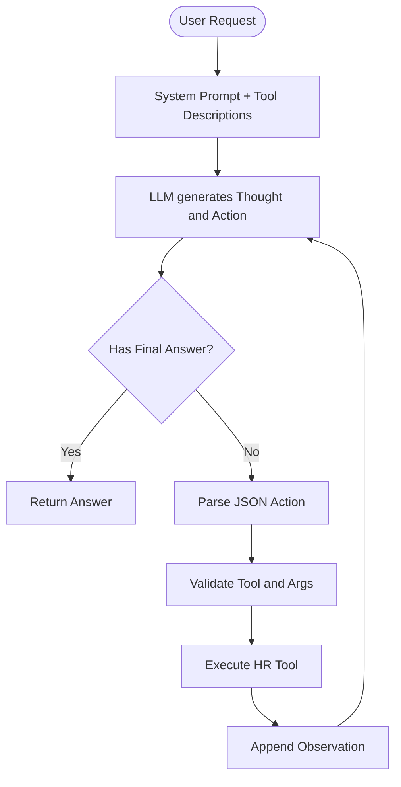

# Bao cao Nhom: Lab 3 - HR ReAct Agent

- **Team Name**: B6
- **Team Members**: Nguyen Van Duy, Nghiem Tuan Linh, Nguyen Manh Hieu, Dang Minh Chuc, Tran Van Khoa
- **Deployment Date**: 01/06/2026

---

## 1. Executive Summary

Du an xay dung mot tro ly quan ly nhan su noi bo, so sanh giua **Chatbot Baseline** va **ReAct Agent**. Chatbot Baseline chi goi LLM truc tiep, trong khi ReAct Agent co the suy luan theo vong lap `Thought -> Action -> Observation`, goi cac cong cu HR de tra cuu du lieu nhan vien, ngay phep, bang luong va chinh sach cong ty.

- **Tap kiem thu**: `tests/test_hr_agent.py` gom 10 scenario HR, bao phu cau hoi policy, lookup, leave balance, payroll, multi-step va failure case.
- **Ket qua chinh**: ReAct Agent v2 giam loi so voi v1 bang cach them retry khi Action JSON sai, validate ten tool, validate tham so bat buoc va gioi han `max_steps`.
- **Gia tri hoc duoc**: Chatbot phu hop voi cau hoi ngon ngu tong quat, nhung Agent dang tin cay hon voi cau hoi can du lieu noi bo va tinh toan nhieu buoc.

---

## 2. System Architecture & Tooling

### 2.1 ReAct Loop Implementation

ReAct Agent duoc cai dat tai `src/agent/agent.py`. Moi request duoc xu ly theo vong lap:



Agent v2 co them cac guardrail:

- Retry khi LLM sinh Action khong dung JSON.
- Kiem tra tool co ton tai trong `TOOLS_MAP`.
- Kiem tra tham so bat buoc theo metadata.
- Gioi han so vong lap bang `max_steps`.
- Gioi han pham vi: agent chi tra loi cau hoi lien quan quan ly nhan su.

### 2.2 Tool Definitions

| Tool Name | Input Format | Use Case |
| :--- | :--- | :--- |
| `get_employee` | JSON: `employee_id_or_name` | Lay ho so nhan vien: ID, ten, phong ban, chuc vu, manager, ngay vao cong ty. |
| `get_leave_balance` | JSON: `employee_id_or_name` | Lay ngay phep nam, ngay da dung va ngay con lai. |
| `calculate_payroll` | JSON: `employee_id_or_name`, optional `month` | Tinh luong thuc nhan: base salary + bonus + allowance - deductions. |
| `search_policy` | JSON: `query` | Tim chinh sach HR theo tu khoa: leave, remote work, OT, payroll. |
| `list_department_employees` | JSON: `department` | Liet ke nhan vien theo phong ban: Engineering, Sales, HR. |

### 2.3 LLM Providers Used

- **Primary for current local demo**: Ollama with `llama3.2`
- **Supported backup providers**: OpenAI, Gemini, local GGUF via `llama-cpp-python`

Provider switching duoc cai dat trong `src/core/provider_factory.py`. Cau hinh hien tai su dung:

```env
DEFAULT_PROVIDER=ollama
DEFAULT_MODEL=llama3.2
OLLAMA_BASE_URL=http://localhost:11434
OLLAMA_MODEL=llama3.2
```

---

## 3. Telemetry & Performance Dashboard

He thong co telemetry tai `src/telemetry/logger.py` va `src/telemetry/metrics.py`. Moi lan goi LLM duoc log cac metric:

- Provider va model
- Prompt tokens
- Completion tokens
- Total tokens
- Latency
- Estimated cost

Kiem tra hien tai tren may local:

| Check | Result |
| :--- | :--- |
| Ollama connection | Pass |
| Available model | `llama3.2:latest` |
| Unit test | `1 passed` |
| ReAct smoke test | Pass |
| Streamlit GUI | HTTP 200 |
| Cost | `$0.000000` vi chay local qua Ollama |

Vi chay local model, latency cao hon API cloud. Mot smoke test HR voi cau "Nhan vien NV003 con bao nhieu ngay nghi phep nam?" hoan thanh trong 2 ReAct steps va tra loi dung: **4 ngay nghi phep nam**.

---

## 4. Root Cause Analysis (RCA) - Failure Traces

### Case Study 1: Malformed JSON Action

- **Input**: "Tinh luong thuc nhan thang nay cua Nguyen Van A?"
- **Observation**: Agent v1 co the sinh Action theo dang tu nhien, vi du `Action: get_employee("Nguyen Van A")`, khong phai JSON hop le.
- **Root Cause**: Prompt v1 chua du manh de bat LLM xuat dung format JSON, parser lai yeu cau JSON nghiem ngat.
- **Fix in v2**: Khi parse Action loi, agent dua Observation phan hoi lai cho LLM va yeu cau xuat lai dung format:

```text
Action: {"tool": "tool_name", "args": {"param": "value"}}
```

### Case Study 2: Missing Required Argument

- **Input**: "Hay tinh giup toi luong thuc nhan thang nay cua nhan vien."
- **Observation**: LLM co the goi `calculate_payroll` voi `args` rong.
- **Root Cause**: Cau hoi thieu ten hoac ma nhan vien, trong khi tool can `employee_id_or_name`.
- **Fix in v2**: `_validate_args()` kiem tra required parameters truoc khi goi Python tool. Neu thieu tham so, agent nhan Observation loi va phai hoi lai nguoi dung hoac tra loi rang thieu thong tin.

### Case Study 3: Out-of-scope Request

- **Input**: "Viet cho toi mot bai tho ve mua xuan."
- **Observation**: Neu khong co domain boundary, LLM co the tra loi ngoai muc tieu HR.
- **Root Cause**: System prompt ban dau chi noi agent la HR Agent, chua yeu cau tu choi cau hoi ngoai pham vi.
- **Fix**: Them rule vao system prompt: agent chi tra loi cau hoi quan ly nhan su; cau ngoai HR thi tu choi ngan gon bang tieng Viet va khong goi tool.

---

## 5. Ablation Studies & Experiments

### Experiment 1: Chatbot Baseline vs ReAct Agent

| Case | Chatbot Baseline | ReAct Agent | Winner |
| :--- | :--- | :--- | :--- |
| Simple HR policy | Co the tra loi chung chung, de sai policy noi bo | Goi `search_policy` de lay policy noi bo | Agent |
| Leave balance | Khong co database, de hallucinate | Goi `get_leave_balance` | Agent |
| Payroll calculation | Khong co du lieu luong noi bo | Goi `calculate_payroll` va tinh bang backend | Agent |
| Missing employee | De doan sai | Tool tra loi khong tim thay | Agent |
| Non-HR request | Co the tra loi binh thuong | Tu choi dung pham vi HR | Agent v2 |

### Experiment 2: Agent v1 vs Agent v2

| Capability | Agent v1 | Agent v2 |
| :--- | :--- | :--- |
| ReAct loop | Co | Co |
| Tool calling | Co | Co |
| JSON parse recovery | Chua tot | Co retry feedback |
| Tool-name guardrail | Chua day du | Co validate |
| Required-arg validation | Chua day du | Co validate |
| Out-of-scope handling | Chua ro | Co rule trong system prompt |

---

## 6. Production Readiness Review

- **Security**: Can them RBAC cho du lieu nhay cam nhu luong. Vi du nhan vien thuong khong nen xem payroll cua nguoi khac.
- **Privacy**: Log hien tai co the ghi noi dung request va result. Khi dua vao production can mask thong tin luong, ID nhan vien hoac du lieu ca nhan.
- **Guardrails**: Da co `max_steps`, validate tool va validate args. Can them prompt-injection defense neu ket noi voi du lieu that.
- **Reliability**: Nen them automated scoring cho 10 scenario thay vi chi manual review.
- **Scaling**: Co the chuyen mock data sang database/RAG, va dung LangGraph neu workflow HR co phe duyet nhieu buoc.
- **Monitoring**: Nen them aggregate report tu logs: success rate, parser error rate, avg latency, avg token, avg steps.

---

## 7. How to Reproduce

### Run tests

```powershell
.\.venv\Scripts\python.exe -m pytest -q
```

### Run Streamlit demo

```powershell
.\.venv\Scripts\python.exe -m streamlit run src\Gui\app.py
```

Open:

```text
http://localhost:8501
```

### Run comparative evaluation

```powershell
.\.venv\Scripts\python.exe tests\test_hr_agent.py
```

The script writes a generated report to:

```text
report/comparative_evaluation_report.md
```
